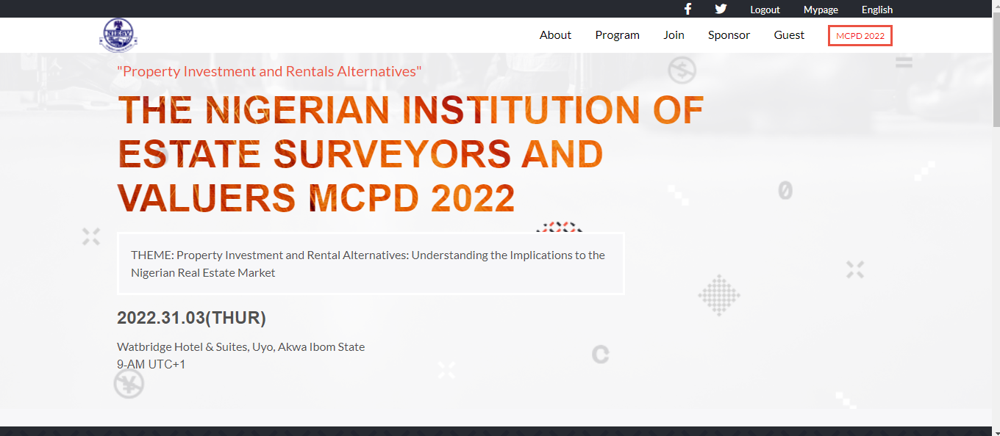

# Capstone Module 1

Final Project Using HTML,CSS and JAVASCRIPT (Microverse Module 1 Curriculum)

  

  

This project is meant to test student ability's on being able to put together all that they have learnt in module1 to ensure mastery in core concepts.

## Built With

- HTML
- CSS
- JAVASCRIPT

Here's a [video ]() of me giving a few description of the project.

## Live Demo

[Live Demo Link](https://kelomo2502.github.io/Capstone-Project1/)

## Getting Started

To get a local copy up and running:

1. Clone this repository or download the Zip folder:

**``git clone https://github.com/kelomo2502/Capstone-Project1.git``**

2. Navigate to the location of the folder in your machine:

**``you@your-Pc-name:~$ cd <folder>``**

## Author

👤 **Oyewunmi Gbenga kelvin**

- GitHub: [@kelomo2502](https://github.com/kelomo2502)
- Twitter: [@kelvin2502](https://twitter.com/kelvin2502)
- LinkedIn: [LinkedIn](https://linkedin.com/ingbenga-oyewunmi)
## Credits

- The original design ideal by [Cindy Shin in Behance](https://www.behance.net/adagio07)

- Project from [Microverse](https://bit.ly/MicroverseTN) html.css & javascript module
- Images inspired by this [All avatar images](https://pravatar.cc/images)

## Contributing

Contributions, issues, and feature requests are welcome!

## Show your support

Give a ⭐️ if you like this project and how we manage to build it!

## 📝 License

This project is [MIT](./MIT.md) licensed
